昨今、既存のAIツールを組み合わせて業務を効率化する例は増えてきていますが、AIツールをうまく連携させられないケースもいまだ数多く存在します。
自分たちが開発した管理画面を用いた運用業務はその代表例と言っていいでしょう。こういった運用業務は業種によっては仕事の比率が高い一方で、まだまだAIを用いた効率化の余地が残されています。
そこで管理画面の様々な機能をAIエージェントから利用できるようにすべく、管理画面のMCPサーバー化を試みました。

主に非エンジニアの人がエージェント経由でMCPサーバーを利用することを想定しており、リモートMCPサーバーに対してURLのみで接続できるようにします。
当然ですが、MCPに対して認可の適切な設定が必要となります。
ユーザー目線で認可のために複雑な設定が必要ないことも重要なポイントです。
管理画面に対しての操作はユーザーごとに権限が異なりますが、MCPサーバー経由でも同様の権限で各種エンドポイントを実行できるようにしています。

今回対象となるプロダクトでは認可サーバーにAWSのCognitoを利用していたのですが、Cognitoでは仕様書に記載されているいくつかの項目がサポートされておらず、実装する上でいくつかハマりポイントがありました。
この記事ではMCPサーバーの認可について紐解きつつ、各種ワークアラウンドを含めて実装方法をまとめておきます。
Cognito前提で記載しますが、おそらく他の認可サーバーでも同様の課題は生じるので適宜読み替えてもらえるとよいと思います。

MCPサーバーにおける認可周りのトピックがメインなので、基本的なOAuth 2.0のフローと認可なしのMCPサーバーの実装自体は割愛します。

<Message type="warn">
十分調査した上で記事を書いたつもりですが、
誤りがあったりセキュリティ的に問題がある記述がありましたら教えていただけると嬉しいです
</Message>

## アーキテクチャ概要

今回作成するMCPサーバーはAPIサーバーのproxyとして動作します。
すなわち、ClaudeなどのMCPクライアントからMCPサーバーへリクエストしてログインした後、MCPサーバーからAPIサーバーにリクエストを送信し、APIサーバーからのレスポンスをMCPクライアントに返しています。
そのため、ユーザーごとの権限のチェックやアクセストークンの検証などはMCPサーバー側では行わず、既存のAPIサーバーのmiddlewareで処理しているものをそのまま流用することにします。
これにより、Web UI経由での操作とMCP経由での操作で権限周りの差分はなくなります。

また、詳細は後述しますが認可フローにおいては認可サーバーのproxyとしての役割も担います。

### MCPクライアント

主に非エンジニアの人でも簡単に設定できて使いやすそうなClaude Desktopを想定していました。
結論から言うと、今回は認可サーバー(Cognito)とClaude Desktopの組み合わせではうまく動作できませんでした。
その代わり、ClaudeCcodeやMCP Inspector上では問題なく動作することを確認しています。

### MCPサーバー

今回実装するサーバーです。
URLのみで接続できるようにStreamable HTTP Transportで実装します。

MCPの実装は主にTypeScriptのSDKとHonoを使用しました。

<Message type="info">
hono: 4.9.4
@hono/mcp: 0.1.2
@modelcontextprotocol/sdk: 1.17.4
</Message>


### 認可サーバー

元々管理画面で使用していたAWS Cognitoを利用します。
user poolは既存のものを利用し、clientを新たに作成して使用しました。

かなりざっくりした全体のフロー図を図示します。

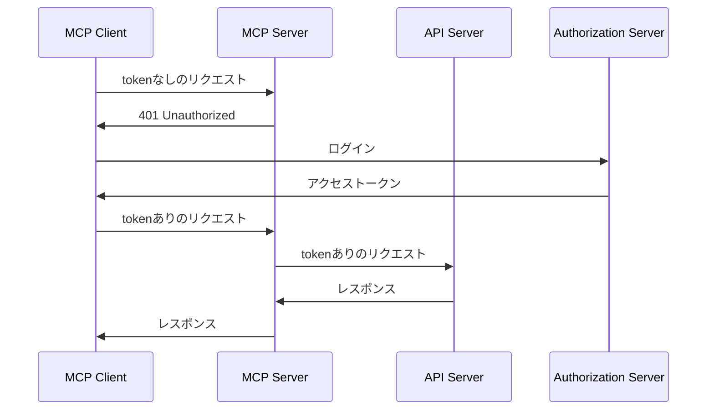

## 認可フローのステップと必要な実装内容

MCPサーバーにおける認可の仕様は以下のドキュメントに記載があります。
この記事内では2025/09時点で最新の「version 2025-06-18」を参考にしています。

<EmbedLink url="https://modelcontextprotocol.io/specification/2025-06-18/basic/authorization" />

ポイントは次の通り
- 認可サーバーはOAuth 2.1 ([draft-ietf-oauth-v2-1-12](https://datatracker.ietf.org/doc/html/draft-ietf-oauth-v2-1-12))を実装する必要がある
- MCPサーバーはOAuth 2.0 Protected Resource Metadata ([RFC9728](https://datatracker.ietf.org/doc/html/rfc9728))を実装する必要がある
- 認可サーバーはOAuth 2.0 Authorization Server Metadata ([RFC8414](https://datatracker.ietf.org/doc/html/rfc8414))を実装する必要がある
- 認可サーバーはOAuth 2.0 Dynamic Client Registration Protocol ([RFC7591](https://datatracker.ietf.org/doc/html/rfc7591))の実装が推奨されている

MCPサーバーはOAuth 2.1におけるresource serverとして動作します。
とは言え、OAuth 2.1自体がまだdraft段階であることや、認可サーバー側が対応できていない仕様もあるのですんなり実装できるわけではありません。

その辺のワークアラウンドの詳細は後述しますが、これらを利用した認可の全体図は以下のようになっています(ドキュメント内のフロー図の再掲)。

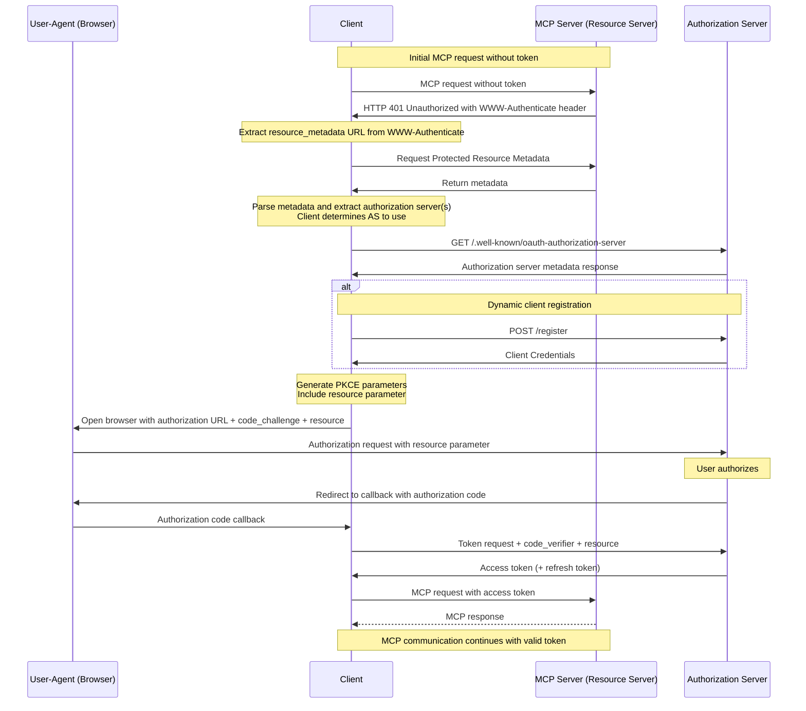

流れを整理します。

1. MCPクライアントがMCPサーバー(Resourceサーバー)にリクエスト
2. トークンがなくて認可が失敗するのでMCPサーバーが401で `WWW-Authenticate`ヘッダーを返却
3. MCPクライアントがMCPサーバーの設定情報のmetadataを取得するエンドポイント(`/.well-known/oauth-protected-resource`)を叩く
4. MCPクライアントが受け取ったmetadataを元に認可サーバーのmetadataを取得するエンドポイント(`/.well-known/oauth-authorization-server`)を叩く
5. (任意, 推奨) MCPクライアントがDynamic Client Registration(DCR)による登録を行う
6. 4で受け取ったmetadataの中にOAuthの認可コードフローに関わる各種エンドポイントが入っているのでこれを元に認証認可を開始する
7. アクセストークンが発行されるのでそれを使ってMCPクライアントがMCPサーバーに再度リクエストする

今回はMCPクライアントはClaude Desktopなどを利用し、認可サーバーにはCognitoを利用するので、認可フローに必要な設定や実装はほぼすべてMCPサーバー側で行うことになります。
MCPサーバー目線で必要な実装を整理すると、以下の2つになることがわかります。
1. 認可失敗時に401で `WWW-Authenticate`ヘッダーを返却する
2. Resourceサーバーのmetadataを取得するエンドポイント(`/.well-known/oauth-protected-resource`)を実装する

1に関しては特に説明不要だと思うので、2に関して記載します。
と言っても、中身はリソースサーバーと認可サーバーのURLを返却するだけでokです。

```ts
app.get("/.well-known/oauth-protected-resource", (c) => {
  const resourceUri = process.env.RESOURCE_URI || "http://localhost:xxxx"
  const region = process.env.REGION || "ap-northeast-1"
  const cognitoUserPoolId = process.env.COGNITO_USER_POOL_ID || "ap-northeast-1_xxxxxxxxx"

  return c.json({
    resource: resourceUri,
    authorization_servers: [`https://cognito-idp.${region}.amazonaws.com/${cognitoUserPoolId}`],
  })
})
```

MCPクライアントは、このレスポンスによって得られた情報を元に認可サーバーの`/.well-known/oauth-authorization-server`を叩くことで認可サーバーのmetadataを取得することができます。
実際にこのエンドポイントを叩くと以下のようなレスポンスが得られ、`authorization_endpoint`や`token_endpoint`を始めとした認可コードフローで使用する様々な情報が取得できていることがわかります。

```json
{
  "issuer": "https://cognito-idp...",
  "authorization_endpoint": "https://example.amazoncognito.com/oauth2/authorize",
  "token_endpoint": "https://example.amazoncognito.com/oauth2/token",
  "response_types_supported": [
    "code"
  ],
  "grant_types_supported": [
    "authorization_code",
    "refresh_token"
  ],
  "code_challenge_methods_supported": [
    "S256"
  ],
  ...
}
```

この情報を元にユーザー(ブラウザ)およびMCPクライアントは認可サーバーとの間で認可フローを開始することができるようになりました。

こう書くとたったこれだけで認可に必要な実装が完了したように思いますが、現実はそう甘くはありません。
次項でその課題について説明します。

## Dynamic Client Registration(DCR)の非サポートによる課題

MCPの認可仕様では認可コードフローを利用します。
認可コードフローでは事前のクライアントの登録とリダイレクトURIの設定が必要になります。
多様なMCPクライアントからの利用がありえることを考慮すると、これらMCPクライアントごとに毎回認可サーバーに個別にクライアントを登録するのは現実的ではありません。

そのため、MCPの認可仕様ではDynamic Client Registration(DCR)のサポートが推奨事項になっています。
DCRはクライアントが自身を動的にクライアントとして登録できる仕組みです。
`/register`エンドポイントに対してリダイレクトURIを含めてリクエストするとclient id(+ client secret)が返却されるのでこれを使用して認可コードフローを開始します。

DCRは認可サーバーがサポートしている必要がありますが、2025/09時点では一部の認可サーバー以外はサポートしていません。
少なくともAWS Cognitoはサポートしておらず、先ほどのmetadataの中には`registration_endpoint`が含まれていませんでした。
今回のユースケース的には当面は1つのクライアントから接続できればよいことと、仕様書ではあくまで推奨事項なので無視してもいいのではと思ったのですが、
実際にMCP Inspectorで動作確認すると`/register`エンドポイントへリクエストできずにエラーになってしまいました。
さすがにlocalで挙動確認できないのは厳しいので、推奨と言いつつ実質ほぼ必須なのではと思っています。

そのため何かしらのワークアラウンドが必要になりますが、仕様書には以下のように記載があります。

> Any authorization servers that do not support Dynamic Client Registration need to provide alternative ways to obtain a client ID (and, if applicable, client credentials). For one of these authorization servers, MCP clients will have to either:
> 1. Hardcode a client ID (and, if applicable, client credentials) specifically for the MCP client to use when interacting with that authorization server, or
> 2. Present a UI to users that allows them to enter these details, after registering an OAuth client themselves (e.g., through a configuration interface hosted by the server).

> AI日本語訳
> 動的クライアント登録をサポートしていない認可サーバーは、クライアントID（および該当する場合はクライアント認証情報）を取得するための代替手段を提供する必要があります。これらの認可サーバーの1つについて、MCPクライアントは以下のいずれかを行う必要があります：
> 1. その認可サーバーとやり取りする際にMCPクライアントが使用するクライアントID（および該当する場合はクライアント認証情報）を具体的にハードコードする、または
> 2. ユーザーが自分でOAuthクライアントを登録した後（例：サーバーがホストする設定インターフェースを通じて）、これらの詳細を入力できるUIをユーザーに提示する。

1の事前に登録しておいたclient IDをハードコードする方法がサクッとできそうですが、MCPクライアント側が設定できる口を用意していなければ使えません。

これに対する解決方法を次項で記載します。

## Authorization Proxyの実装

先ほどの課題に対しては、どこかでMCPクライアントに事前に登録しておいたclient idを伝える必要があります。
結論、**認可サーバーに対するproxyサーバーを用意する**ことで解決します。
今回はMCPサーバーにその役割を持たせています。

具体的には、MCPサーバー上に`/register`エンドポイントを用意し、あらかじめ登録しておいたクライアントのclient idを固定値で返却するようにします。
そして、MCPクライアントがこのエンドポイントを叩けるように伝える必要があるため、`/.well-known/oauth-authorization-server`で返されるmetadataの中に`registration_endpoint`を含めて返却する必要があります。
ただし、Cognitoのレスポンスを変えることはできないので、この`/.well-known/oauth-authorization-server`もMCPサーバー側で用意するようにします。

この対応により、DynamicさのかけらもないDCRを形式上対応できたことになります。
また、認可エンドポイントとトークンエンドポイントもMCPサーバー側でproxyするようにします。

詳細は後述しますが、先に全体像を図示すると次のようになります。

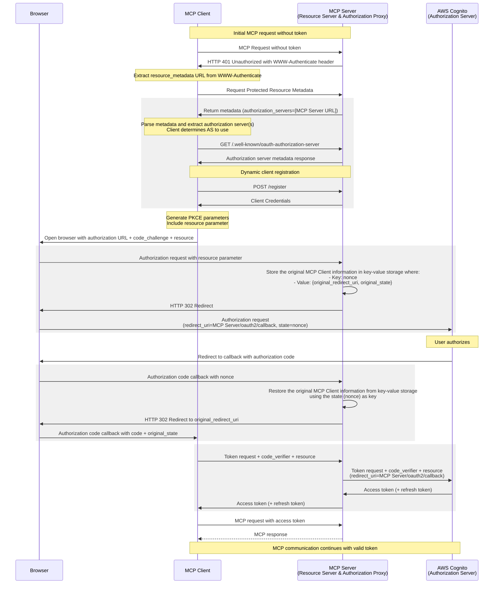

ハイライトしている箇所が変更した処理で、いずれも本来認可サーバーで行う処理をMCPサーバーで行うようにしています。

元のフローと比較するとだいぶ複雑になった感が否めませんが、一つずつ詳しく見ていきましょう。

### 1. DCR
#### 1.1. Protected Resource Metadata

リソースサーバーのMeatadataを返却するエンドポイントで`authorization_servers`をCognitoのドメインにしていましたが、これをMCPサーバー自身に変更します。

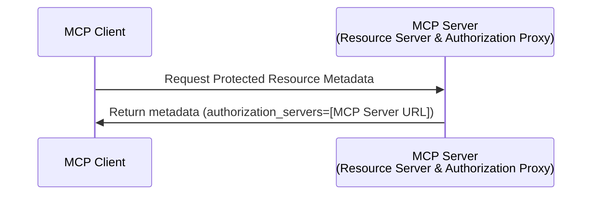

```ts {3-4,8}#remove {9}#add
app.get("/.well-known/oauth-protected-resource", (c) => {
  const resourceUri = process.env.RESOURCE_URI || "http://localhost:xxxx"
  const region = process.env.REGION || "ap-northeast-1"
  const cognitoUserPoolId = process.env.COGNITO_USER_POOL_ID || "ap-northeast-1_xxxxxxxxx"

  return c.json({
    resource: resourceUri,
    authorization_servers: [`https://cognito-idp.${region}.amazonaws.com/${cognitoUserPoolId}`],
    authorization_servers: [resourceUri], // CognitoではなくMCPサーバーのURLを指定
  })
})
```

#### 1.2. Authorization Server Metadata

Protected Resource Metadataの変更により、認可サーバーのmetadataをレスポンスする責務はCognitoではなくMCPサーバーになりました。

before
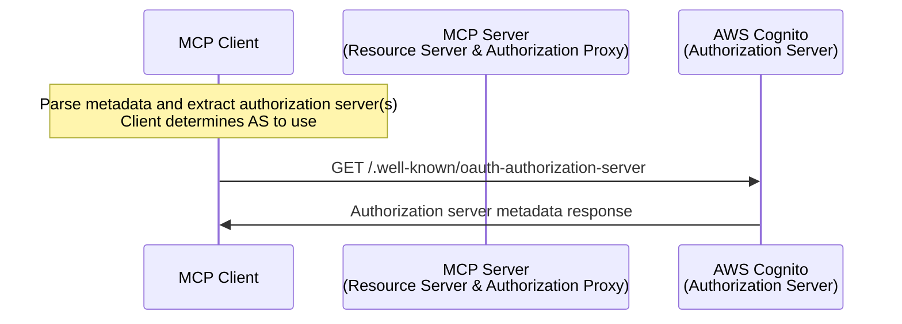

after
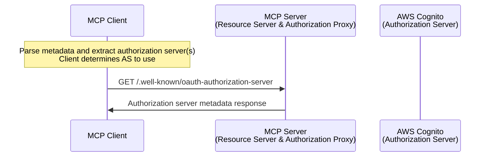

以下が認可サーバーのMeatadataを返却するエンドポイントの実装です。
中身は基本的にはCognitoがレスポンスするものと同じですが、以下の点が異なります。
- DCR用の`registration_endpoint`が追加されている
- `authorization_endpoint`と`token_endpoint`が認可サーバーではなくMCPサーバーのエンドポイントになっている (理由は後述)

```ts {4-5,12}
app.get("/.well-known/oauth-authorization-server", (c) => {
  return c.json({
    issuer: `https://cognito-idp.ap-northeast-1.amazonaws.com/${cognitoUserPoolId}`,
    authorization_endpoint: `${resourceUri}/oauth2/authorize`, // CognitoではなくMCPサーバーのURLを指定
    registration_endpoint: `${resourceUri}/register`, // Cognitoのレスポンスでは存在しないため追加
    jwks_uri: `https://cognito-idp.ap-northeast-1.amazonaws.com/${cognitoUserPoolId}/.well-known/jwks.json`,
    response_types_supported: ["code"],
    grant_types_supported: ["authorization_code", "refresh_token"],
    code_challenge_methods_supported: ["S256"],
    scopes_supported: ["openid", "profile", "email"],
    token_endpoint_auth_methods_supported: ["none"],
    token_endpoint: `${resourceUri}/oauth2/token`, // CognitoではなくMCPサーバーのURLを指定
  })
})
```

#### 1.3. registerエンドポイント

metadataの中の`registration_endpoint`をMCPサーバーのエンドポイントにしたので、`/register`エンドポイントの向き先もMCP側になります。

before
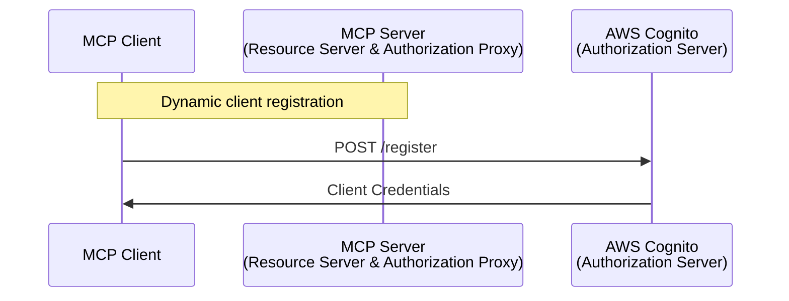

after
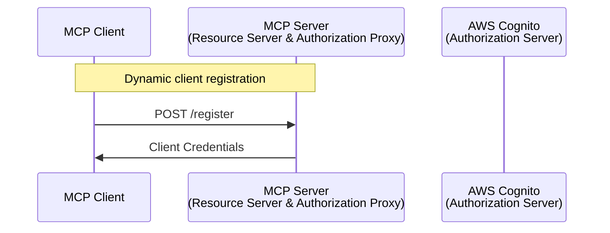

以下が`/register`エンドポイントの実装です。
`client_id`は事前に登録しておいたClient IDを固定値で返却するので、全くDynamicではありませんね...
`redirect_uris`はリクエストの`redirect_uris`をそのまま利用しており、これはMCPクライアントのリダイレクトURIが格納されることになります。
他のフィールドも一応設定してますが、少なくともMCP Inspector上ではなくても動作しました。

```ts
app.post("/register", async (c) => {
  const requestBody = await c.req.json()
  const cognitoClientId = process.env.COGNITO_CLIENT_ID || ""

  return c.json({
    client_id: cognitoClientId, // 事前に作成したClient ID
    client_secret: "not_required",
    client_id_issued_at: Math.floor(Date.now() / 1000),
    redirect_uris: requestBody.redirect_uris,
    grant_types: requestBody.grant_types || ["authorization_code", "refresh_token"],
    token_endpoint_auth_method: "none",
    client_name: requestBody.client_name || "MCP Client",
  })
})
```

これにより、形式上はDCRをサポートした状態になります。

### 2. 認可エンドポイント

metadataの中の`authorization_endpoint`をMCPサーバーのエンドポイントにしたので、`/oauth2/authorize`エンドポイントの向き先もMCPサーバーになります。
こうした理由は、Cognito側にあらかじめ登録するクライアントのリダイレクトURIをMCPサーバーのcallback用のエンドポイントに固定化させるためです。

before
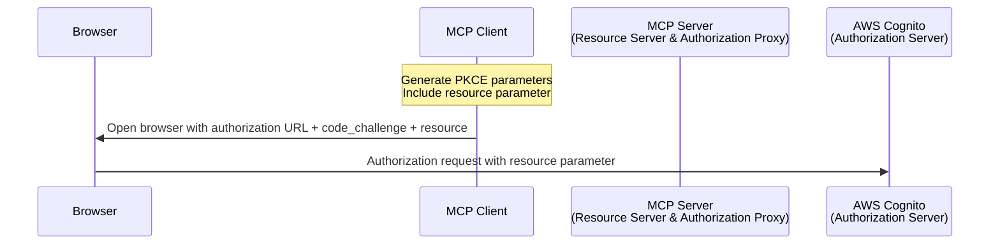

after
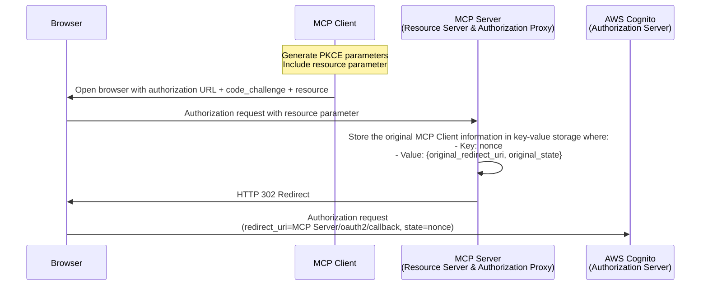

処理内容としてはリクエストの内容を組み立てて、ブラウザにリダイレクトさせるだけですが、ここでのポイントは以下です。
- リクエスト中のMCPクライアントが発行したstateとredirect_uriをランダムな値をkeyにしたKVに格納しておく (短めのTTLを設定)
- stateには上記KVのkeyを格納する
- リダイレクトURIをMCPサーバーのエンドポイントに設定する

Cognitoのクライアントでは、このMCPサーバーのcallbackエンドポイントをリダイレクトURIに設定しておく必要があります。
逆に言えば、このcallbackエンドポイント1つをリダイレクトURIとして登録してさえいれば、MCPクライアントごとに異なるリダイレクトURIを個別設定する必要がなくなるとも言えます。
MCPクライアントのリダイレクトURIをホワイトリスト的に検証しておくと、セキュアになるかと思います。

```ts {14-16,22,24}
app.get("/oauth2/authorize", async (c) => {
  const cognitoDomain = process.env.COGNITO_DOMAIN || ""
  const resourceUri = process.env.RESOURCE_URI || "http://localhost:8081"

  const query = c.req.query()
  if (new URL(query.resource).href !== new URL(resourceUri).href) {
    return c.json({ error: "invalid_resource" }, 400)
  }

  if (!isAllowedRedirectUri(query.redirect_uri)) {
    return c.json({ error: "invalid_request" }, 400)
  }

  // MCPクライアントの情報を適当なKVに保存しておく
  const nonce = crypto.randomUUID()
  kv.set(nonce, { original_redirect_uri: query.redirect_uri, original_state: query.state, iat: Date.now() })

  return c.redirect(
    `${cognitoDomain}/oauth2/authorize?${new URLSearchParams({
      response_type: "code",
      client_id: query.client_id,
      redirect_uri: `${resourceUri}/oauth2/callback`, // MCPサーバーのcallback URL
      scope: query.scope || "email openid profile",
      state: nonce,
      code_challenge: query.code_challenge,
      code_challenge_method: "S256",
      resource: query.resource,
    }).toString()}`
  )
})
```

### 3. callbackエンドポイント

認可リクエスト時の`redirect_uri`をMCPサーバーのcallback URLにしたのでcallback先がMCPサーバーになります。

before
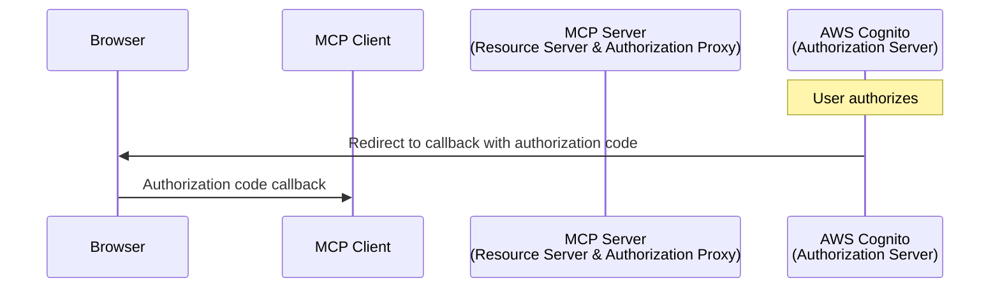

after
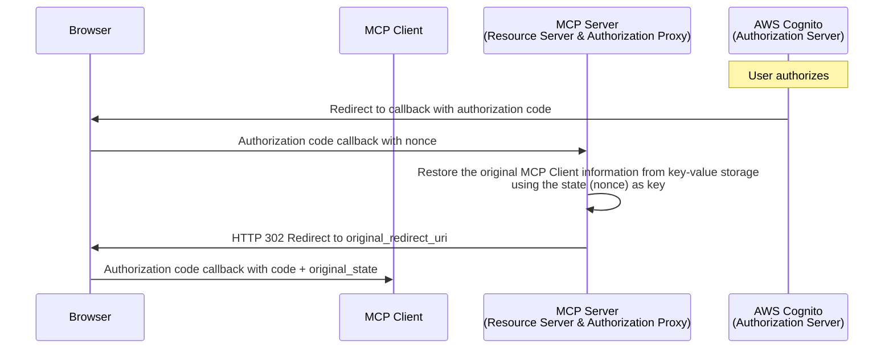

以下がcallbackエンドポイントの実装です。
stateの値を用いて先ほどの認可エンドポイントでKVに格納した値を取得すると、元々のMCPクライアントのstateとredirect_uriを取得できるので、これを元にMCPクライアントにリダイレクトさせます。

```ts
app.get("/oauth2/callback", async (c) => {
  const code = c.req.query("code") || ""
  const state = c.req.query("state") || ""

  // 認可リクエスト時にKVに格納した値から元のclient情報を取得
  const proxyState = kv.get(state)
  if (!proxyState) {
    return c.json({ error: "invalid_state" }, 400)
  }
  kv.delete(state)

  const redirectUrl = new URL(proxyState.original_redirect_uri)
  redirectUrl.searchParams.set("code", code)
  redirectUrl.searchParams.set("state", proxyState.original_state)

  return c.redirect(redirectUrl.toString())
})
```

ここまでの処理で、元々の認可エンドポイントの処理を踏襲することができました。

### 4. tokenエンドポイント

認可リクエストと同様、metadataの中の`token_endpoint`もMCPサーバーのエンドポイントにしたので、`/oauth2/token`エンドポイントの向き先もMCPサーバーになります。

before
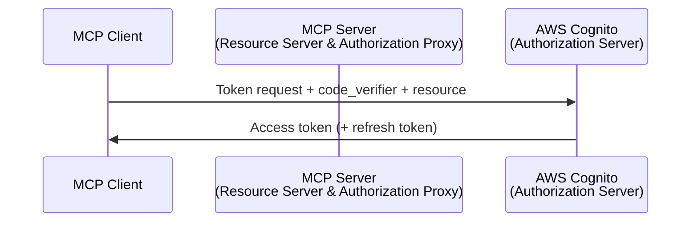

after
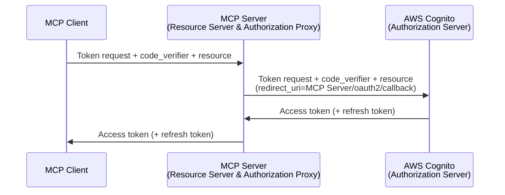

以下がtokenエンドポイントの実装です。
これはシンプルにCognitoのtokenエンドポイントを叩いて、得られたレスポンスをそのまま返却しているだけです。

```ts
app.post("/oauth2/token", async (c) => {
  const resourceUri = process.env.RESOURCE_URI || "http://localhost:8081"
  const cognitoDomain = process.env.COGNITO_DOMAIN || ""
  const cognitoClientId = process.env.COGNITO_CLIENT_ID || ""
  const cognitoClientSecret = process.env.COGNITO_CLIENT_SECRET || ""

  const body = (await c.req.parseBody()) satisfies
    | {
        grant_type: "authorization_code"
        code: string
        code_verifier: string
        resource?: string
      }
    | {
        grant_type: "refresh_token"
        refresh_token: string
        resource?: string
        scope?: string
      }

  if (body.resource && new URL(body.resource).href !== new URL(resourceUri).href) {
    return c.json({ error: "invalid_resource" }, 400)
  }

  const cognitoRequestBody =
    body.grant_type === "authorization_code"
      ? {
          grant_type: body.grant_type,
          code: body.code,
          redirect_uri: `${resourceUri}/oauth2/callback`, // 固定のcallback URL
          client_id: cognitoClientId,
          code_verifier: body.code_verifier,
          ...(body.resource ? { resource: body.resource } : {}),
        }
      : {
          grant_type: body.grant_type,
          refresh_token: body.refresh_token,
          client_id: cognitoClientId,
          ...(body.scope ? { scope: body.scope } : {}),
        }

  const cognitoResponse = await fetch(`${cognitoDomain}/oauth2/token`, {
    method: "POST",
    headers: {
      "Content-Type": "application/x-www-form-urlencoded",
      Authorization: `Basic ${Buffer.from(`${cognitoClientId}:${cognitoClientSecret}`).toString("base64")}`,
    },
    body: new URLSearchParams(cognitoRequestBody).toString(),
  })

  const cognitoTokenResponse = await cognitoResponse.json()
  return c.json(cognitoTokenResponse)
})
```

一見、この処理はproxyする必要がないようにも思いますが、OAuth 2.0ではトークンリクエストでのリダイレクトURIは認可リクエストのものと同じにする必要があります。

ちなみに、OAuth 2.1ではトークンリクエストでのリダイレクトURIは不要となります。
元々これは認可コードのインジェクションを防ぐ目的で必要とされていました。そもそもOAuth 2.1ではPKCEの利用が必須となるためお役御免となり不要となるようです。
>In OAuth 2.1, authorization code injection is prevented by the code_challenge and code_verifier parameters, making the inclusion of the redirect_uri parameter serve no purpose in the token request.  As such, it has been removed.
> *https://datatracker.ietf.org/doc/html/draft-ietf-oauth-v2-1-12#name-redirect-uri-parameter-in-t*

現状、認可サーバーはdraft状態のOAuth 2.1をサポートしていないため、当面はリダイレクトURIを指定する必要があるということになります。

### 5. refresh_tokenによる更新

シーケンス図に記載したフローは完遂したわけですが、最後にアクセストークンの有効期限が切れた場合のリフレッシュトークンによる更新処理について見ていきます。

MCP仕様書には具体的な記載はなかったのですが、少なくともClaude Codeでは401が返されるとtokenエンドポイントに対して`grant_type=refresh_token`でリクエストするようになっていました。おそらくどのクライアントでも同じ挙動になるのではないかと思います。

より正確には一度`/.well-known/oauth-authorization-server`を叩いて`token_endpoint`を取得し、トークンリクエストを行っていました。

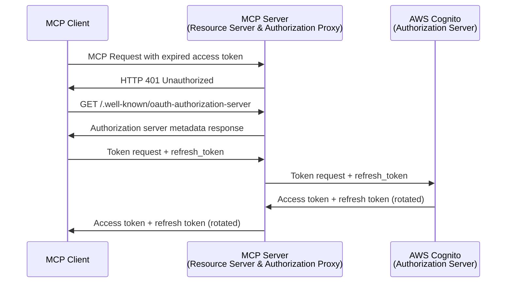

MCP仕様書およびOAuth 2.1ではPublic Clientの場合にはリフレッシュトークンのローテーションが必須である旨が記載されています。

> For public clients, authorization servers MUST rotate refresh tokens as described in OAuth 2.1 Section 4.3.1 “Token Endpoint Extension”.

今回の場合、認可サーバーから見たクライアント種別はConfidential Clientですが、トークンを保管するクライアントはPublic相当なのでリフレッシュトークンのローテーションは対応した方がよいでしょう。
ちょうど数ヶ月前に[Cognitoでリフレッシュトークンのローテーションがサポート](https://aws.amazon.com/about-aws/whats-new/2025/04/amazon-cognito-refresh-token-rotation/)されたので、これをONにします。
すると、レスポンスされるリフレッシュトークンが更新されるようになります。


## 調査メモ

実装する上で気になったことや、実装には含めなかったが仕様に記載してある内容の調査結果を軽くまとめておきます。

### 認可エンドポイントとtokenエンドポイントのproxyの必要性

認可リクエストとトークンリクエストもproxyさせることで、DCRがサポートされていない中でもあらゆるMCPクライアントに対してリダイレクトURIを固定することができました。
その代償として、実装およびフローが複雑になった感は否めません。

仮にあらゆるMCPクライアントをサポートせず、特定のMCPクライアントのみ利用するということであれば、
そのMCPクライアントのリダイレクトURIを設定しておけばわざわざproxyさせる必要はないのではという気もしています。

しかし、少なくともMCP Inspectorではtokenエンドポイントでエラーになってしまいました。
エラー内容が詳しく表示されなかったこともあり詳細までは踏み込んでいません。

### Resource Indicatorsのサポート

MCP仕様書に含まれていて登場していない仕様としてResource Indicatorsがあります。
Resource Indicatorsは、[RFC 8707](https://datatracker.ietf.org/doc/rfc8707/)で定義されたOAuth 2.0の拡張仕様です。

詳細は割愛しますが、ざっくり言うと複数のリソースサーバーがある状況において、クライアントがアクセストークンを使ってリクエストするリソースサーバーを明示的に指定できるようにするための仕組みです。
すなわち、特定のリソースサーバー向けに発行されたアクセストークンが、意図しない別のリソースサーバーで使用されることを防ぐことができるようになります。

仕組みとしては、認可リクエストおよびトークンリクエストにおいて、`resource`パラメータを付与します。

```http {7}
GET /oauth2/authorize?response_type=code
  &client_id=YOUR_CLIENT_ID
  &redirect_uri=https%3A%2F%2Fclient.example.com%2Fcallback
  &scope=openid%20profile%20email%20read
  &state=abc123
  &nonce=123456
  &resource=https%3A%2F%2Fapi.example.com HTTP/1.1
```

得られたaccess tokenをデコードすると`aud`フィールドに、指定したリソースサーバーのURLが格納されています。

```json
{
  "aud": "https://api.example.com/"
  ...
}
```

MCP仕様書にはMCPクライアントは認可リクエストおよびトークンリクエストにおける`resource`パラメータの付与を必須としています。
実際リクエストを見てみると、`resource`パラメータが付与されていることを確認できました。
一方で、Cognitoではまだサポートしていないらしくアクセストークンの中身を解析しても`aud`フィールドは存在しませんでした。

`aud`フィールドを検証するのはMCPサーバーの役割のはずですが、必須ではないことと上記の対応状況を考慮して、今回は実装していません。

### ライブラリの利用

今回は独自実装しましたが、Cloudflare Workersにdeployする場合は、以下のライブラリを利用できそうです。

<EmbedLink url="https://github.com/cloudflare/workers-oauth-provider" />

## 動作確認結果

実装したMCPサーバーをdeployして各種MCPクライアントで動作確認を行いました。
結論、MCP InspectorとClaude Codeでは問題なく動作することを確認できた一方で、Claude Desktopではうまく動作しませんでした。

### MCP Inspector

localhostでもdeployしたサーバーでも問題なく動作しました。

### Claude Code

こちらも認可コードフロー完了後、プロンプトで指示すると意図通りの挙動になることを確認できました。

左から順に、
1. MCPの設定画面で認証スタート
2. 認証開始(と同時にブラウザでログイン画面が開く)
3. ブラウザ上でログイン後、認証成功の画面表示

になっており、これでMCPが利用できるようになります。


実際にMCPを利用した画面がこちらです。
画像はGETのリクエストですが、POSTでのリソース作成も問題なく動作しました。


### Claude Desktop

connectorを設定して接続を試みたのですが、残念ながらログイン画面でclient idが異なるエラーに遭遇してうまくいきませんでした。
今回、元々存在していたCognitoのUser Poolに新しくMCPクライアント用のApp Clientを作成したのですが、どうやらそのClient IDではなく既存のClient IDで接続しようとしてエラーになっていました。

この辺の接続設定がどうなってるかはクライアント側の設定なので把握できてないのですが、正しいClient IDを指定する必要がありそうです。
実は、Adanced settingsなるところにClient IDを指定する項目があります。


しかし、これを指定して接続しようとすると以下のエラーが生じてうまくいきませんでした...

> Custom Auth Client IDs are currently only available for Claude for Work

2025/09現在はチームプランへの加入が必要ということなのでしょうか。
Maxプランなので出来てほしいというのが正直なところですが、今回はこれ以上は踏み込んで検証していません

## まとめ

Cognitoを使ったRemote MCPサーバーの認証認可の実装について紹介しました。
OAuth 2.1自体がdraftであることを考えると仕方ないのかもしれませんが、現状は各種認可サーバー、MCPクライアントともに対応状況がまちまちな印象を受けます。

そのおかげ(?)か、RFCを始めとして様々な資料を読み込んで調査&手元で検証しつつ進められたので理解はかなり進みました。

自分たちが開発している管理画面の操作をMCP経由でできると色々と捗りそうです。
全体的にもう少しシンプルに構成できると嬉しいので、各種認可サーバーおよびMCPクライアントの今後の展開に期待したいところです。

## 参考

<EmbedLink url="https://modelcontextprotocol.io/specification/2025-06-18/basic/authorization" />
<EmbedLink url="https://datatracker.ietf.org/doc/html/draft-ietf-oauth-v2-1-12" />
<EmbedLink url="https://datatracker.ietf.org/doc/rfc7591/" />
<EmbedLink url="https://datatracker.ietf.org/doc/rfc8707/" />
<EmbedLink url="https://qiita.com/moritalous/items/588a8669b0d3a61b9eef" />
<EmbedLink url="https://speakerdeck.com/hi120ki/mcp-authorization" />